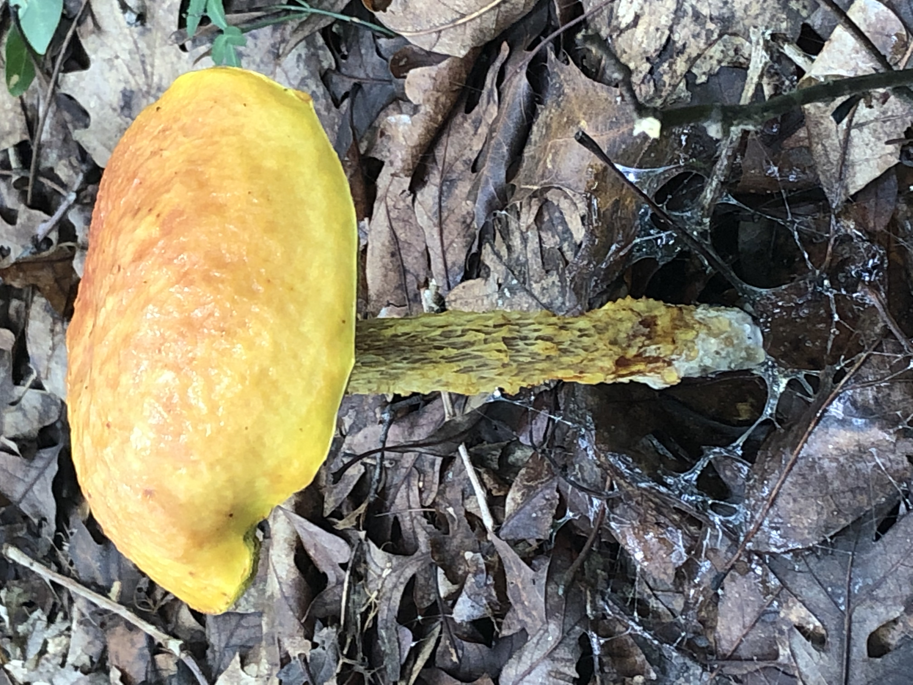
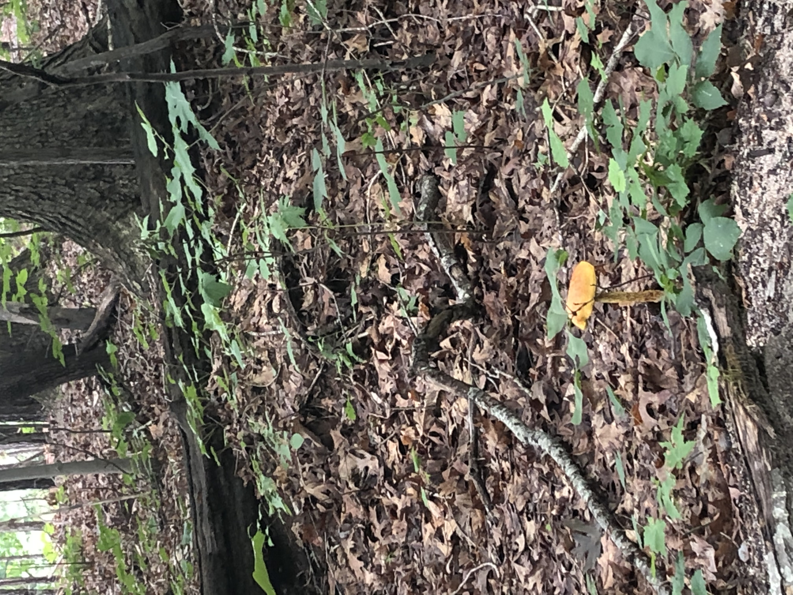
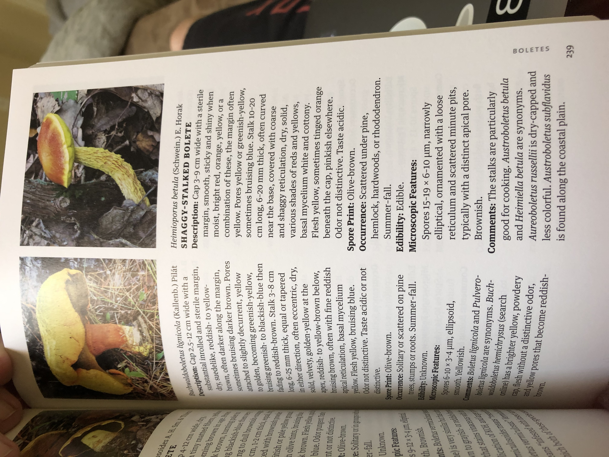

[black big]*Name:
Shaggy-Stalked Bolete*

Date:
Saturday June, 20 2020

Location:
North Cary park, Cary, NC

Scene:
Next to the Greenway.

Book:
A Field Guide to Mushrooms of the Carolinas

Page: 239 Boletes

