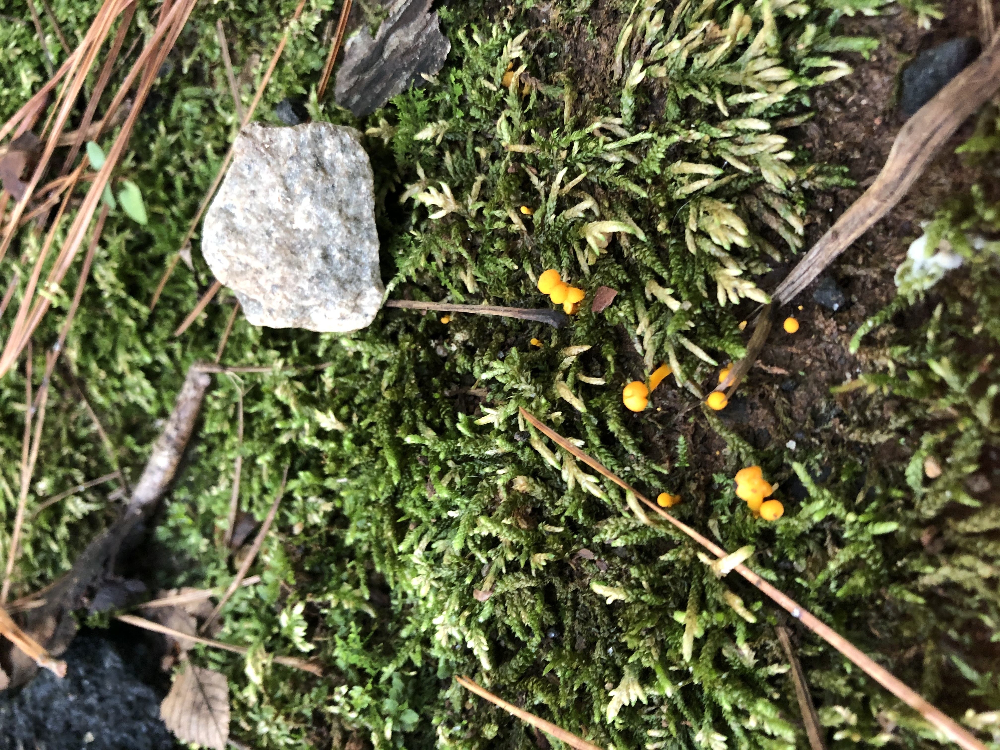
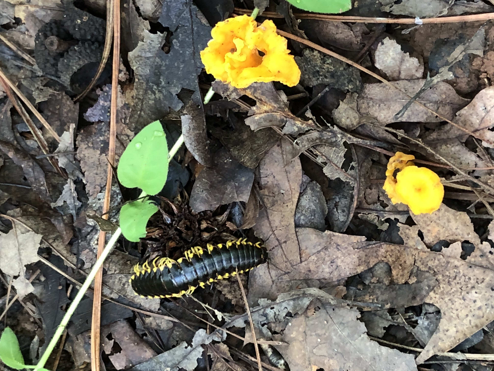
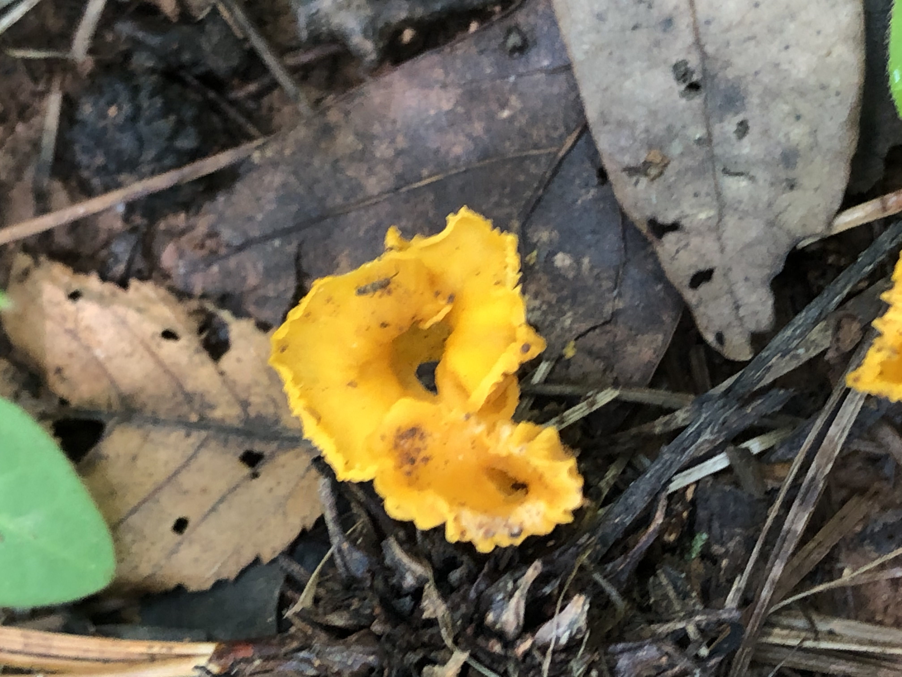
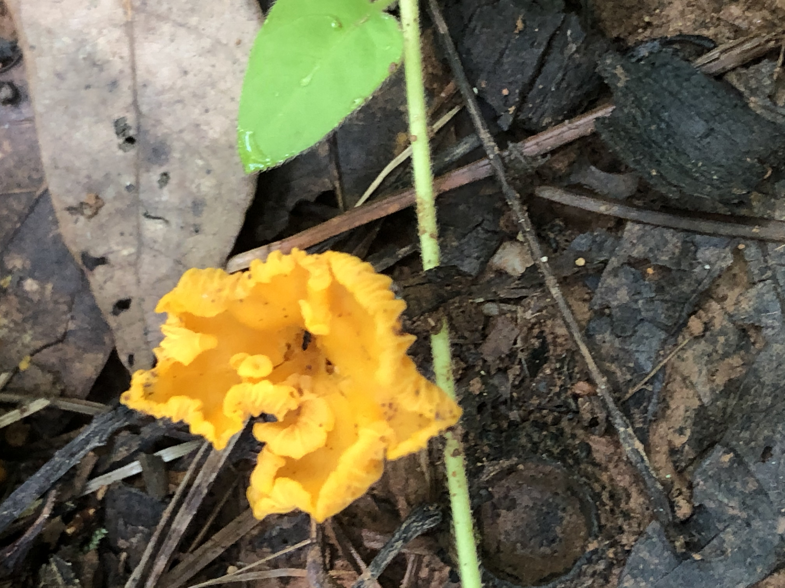
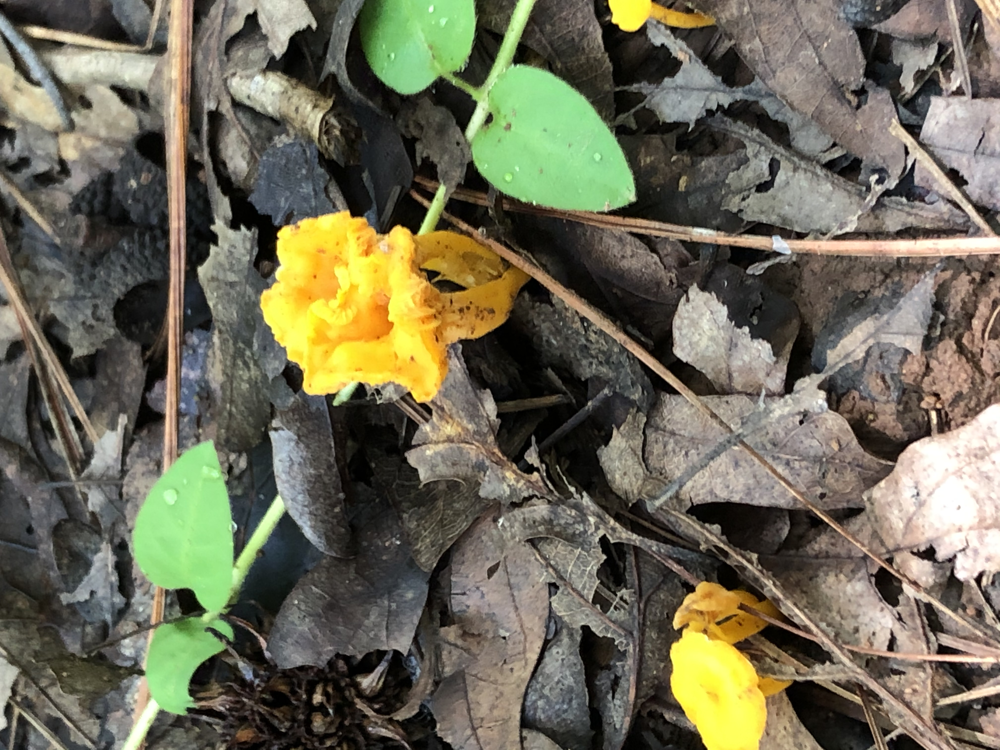
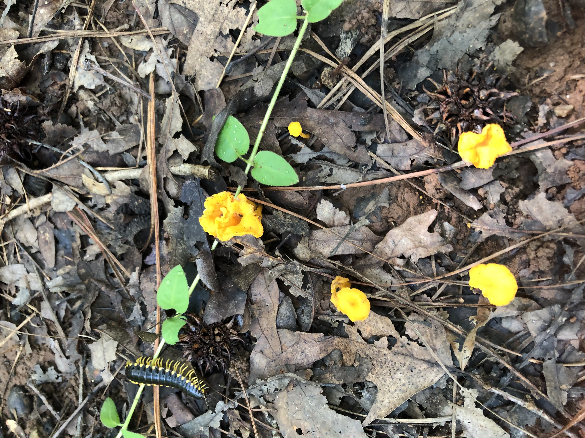

[black big]*Name:
Fragrant Chanterelles*

Date:
Saturday Aug, 15 2020

Location:
Black Creek Greenway Cary , NC

Scene:
On a moss/woods next to Greenway.(Battery Neighborhood)

Book:
A Field Guide to Mushrooms of the Carolinas

Page: 194 Chanterelles

