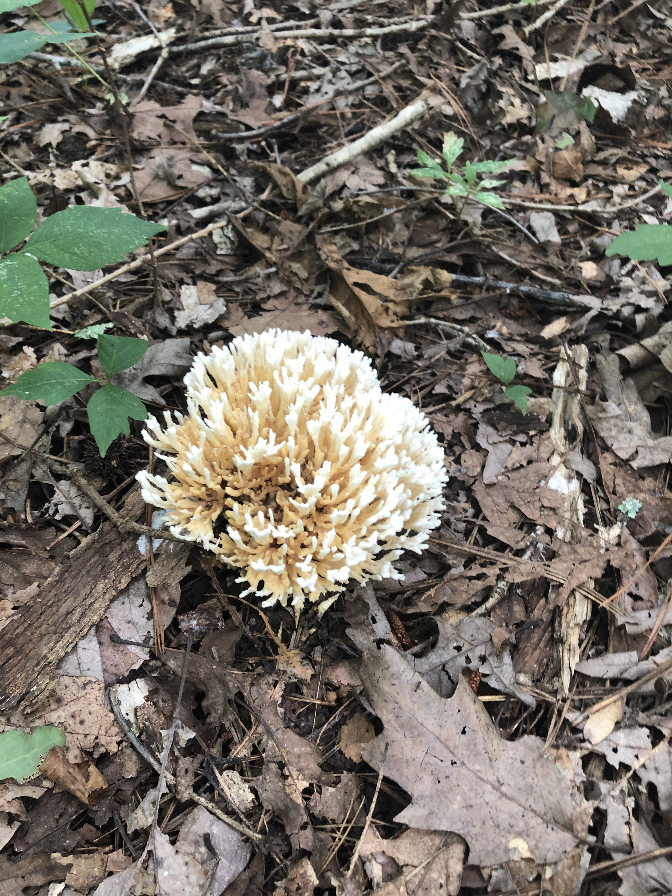
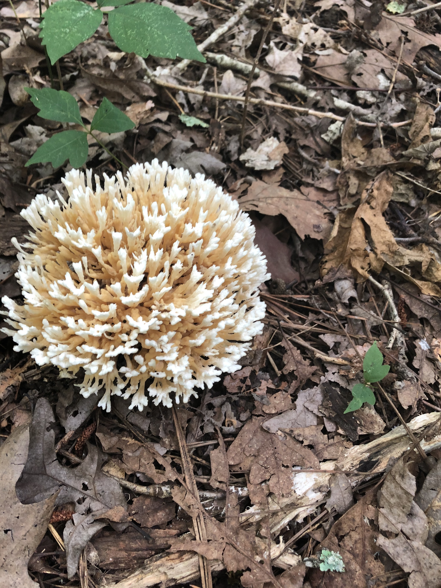

[black big]*Name:
Crown Tipped Coral*

Date:
Sunday Aug, 23 2020

Location:
Black Creek Greenway Cary, NC (Bond Lake Area)

Scene:
On dirt/leaves next to the Greenway.

Book:
A Field Guide to Mushrooms of the Carolinas

Page: 301 Clustered Corals and Cauliflowers

