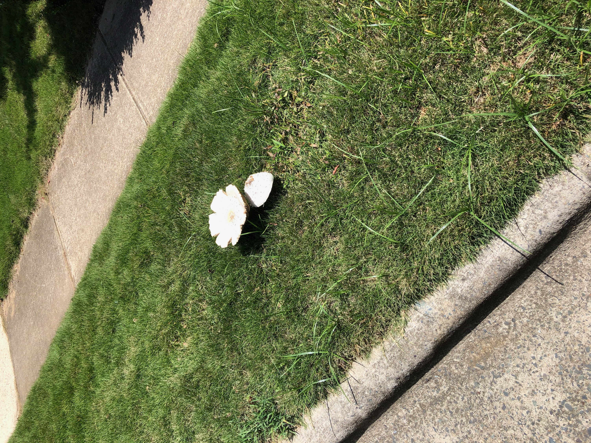
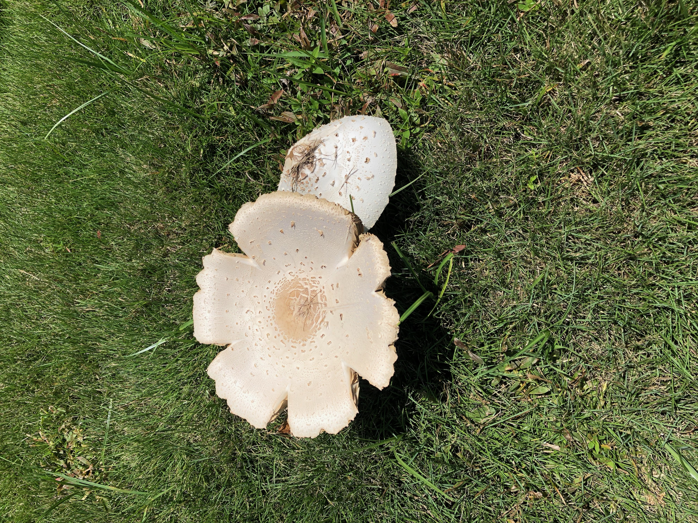
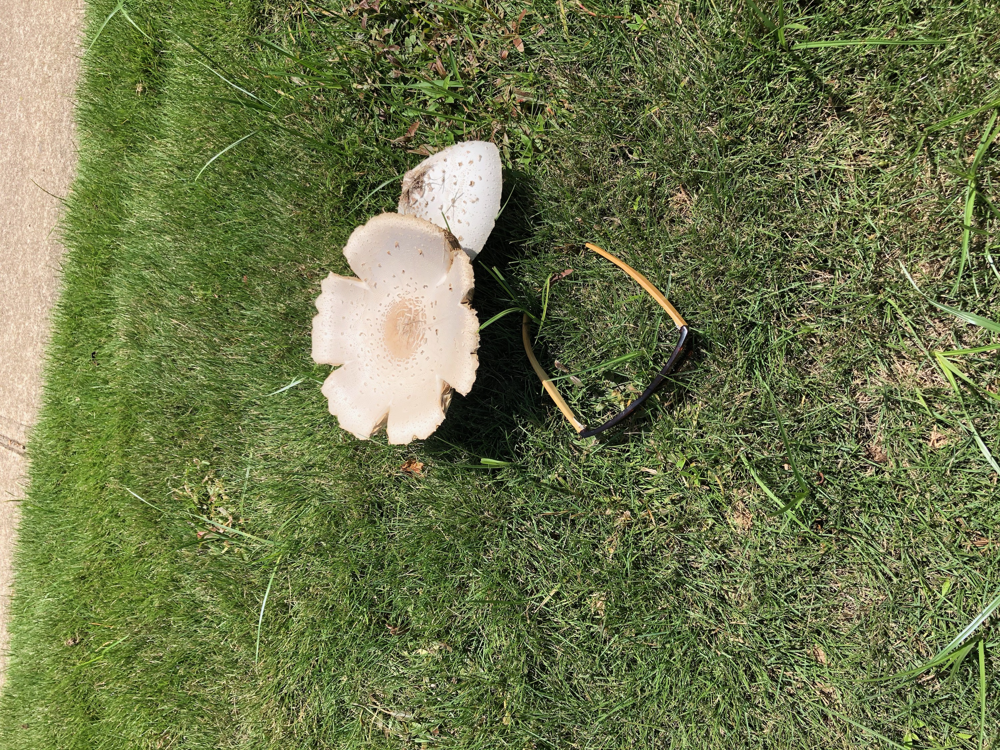
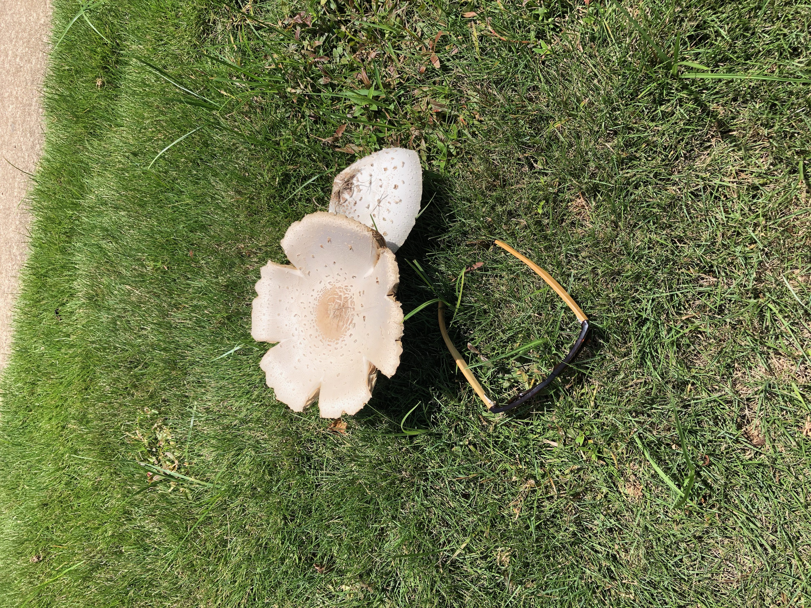
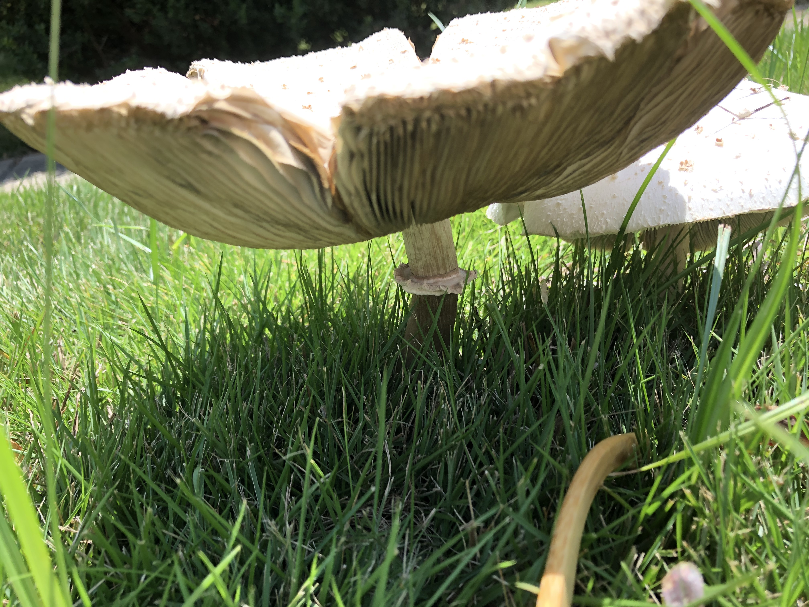

[black big]*Name:
Funnel Veil Amanita*

Date:
Saturday Aug, 01 2020

Location:
Black Creek Greenway Cary , NC

Scene:
On a lawn/grass next to a sidewalk.(Battery Neighborhood)

Book:
A Field Guide to Mushrooms of the Carolinas

Page: 58 Gilled Mushroom

image:photos/IMG_1238.jpeg[640,480]

image:photos/IMG_1239.jpeg[640,480]

image:photos/IMG_1242.jpeg[640,480]

image:photos/IMG_1246.jpeg[640,480]
