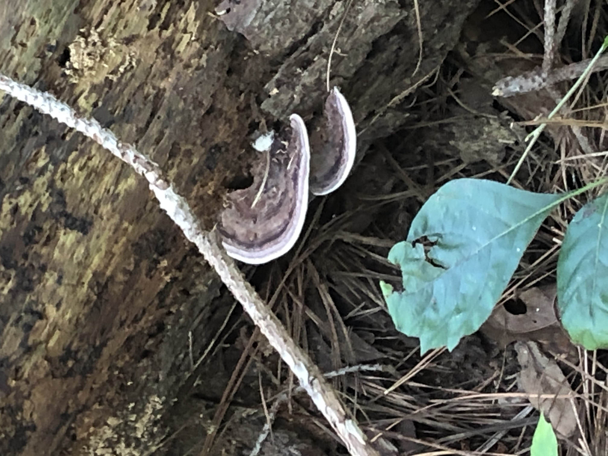
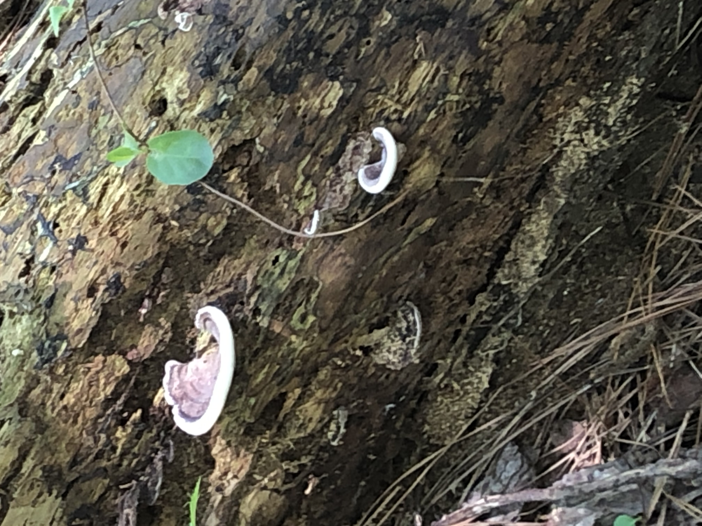
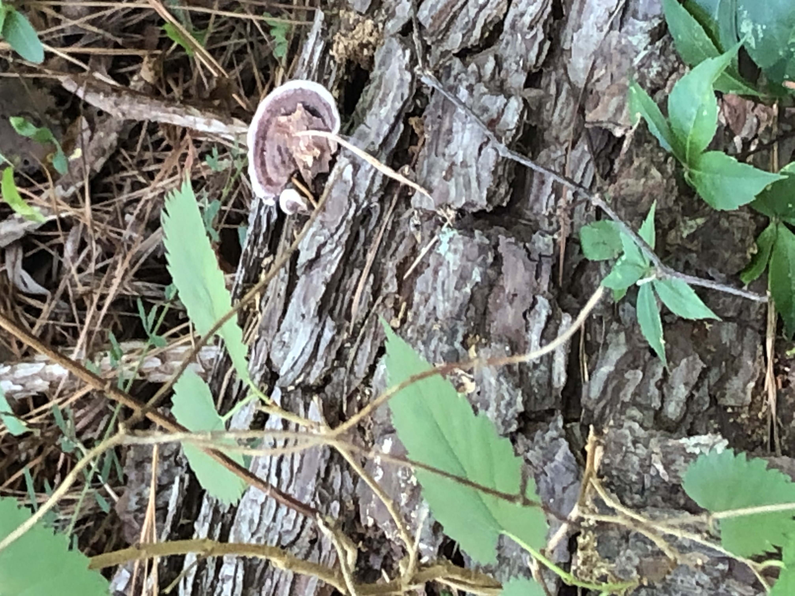
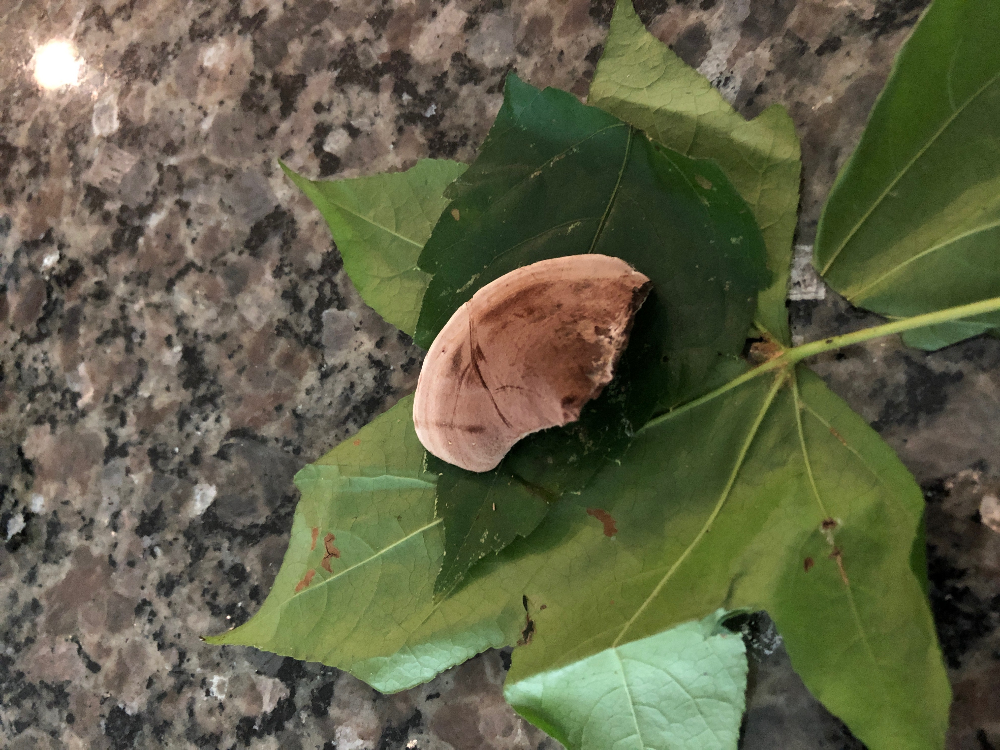
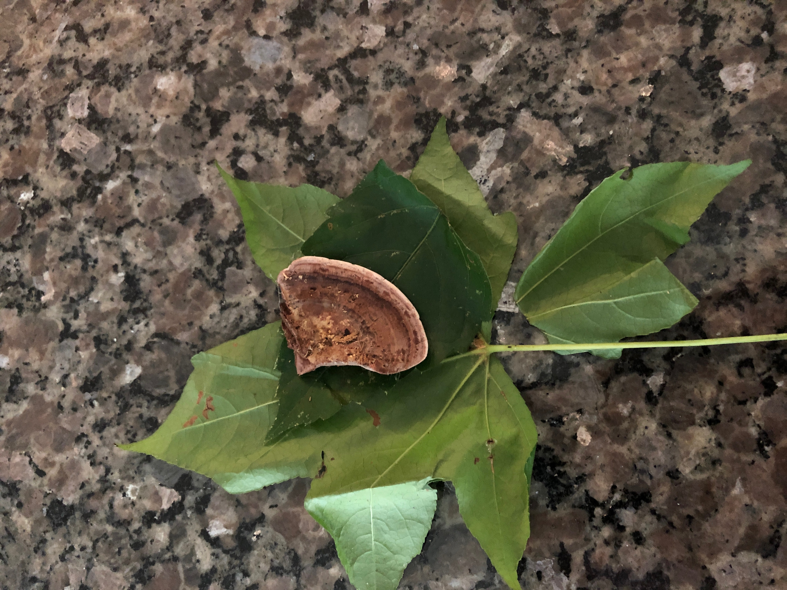
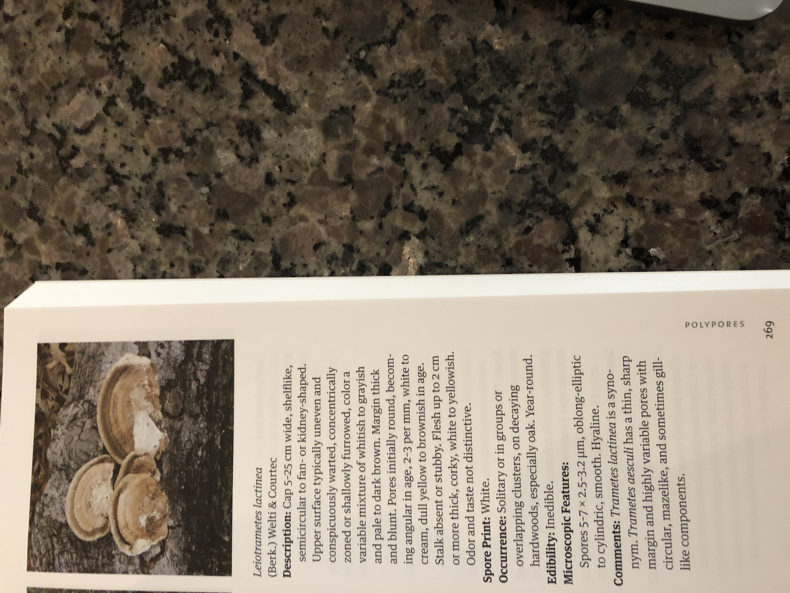

[black big]*Name:
Leiotrametes lactinea*

Date:
Sunday July, 26 2020

Location:
Black Creek Greenway Cary , NC

Scene:
On a fallen log just off the bike path.

Book:
A field Guide to Mushrooms of the Carolinas

Page: 269 Polypores

