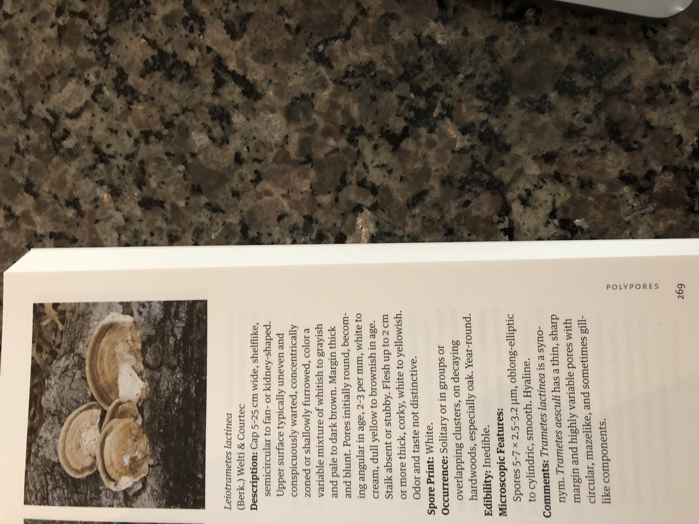

Name:
Leiotrametes lactinea

Date:
Sunday July, 26 2020

Location:
Black Creek Greenway Cary , NC

Scene:
On a fallen log just off the bike path.

Book:
A field Guide to Mushrooms of the Carolinas

Page: 269 Polypores

image:photos/single-log.jpeg[]

image:photos/double-log.jpeg[]

image:photos/third-log.jpeg[]

image:photos/back.jpeg[]

image:photos/front.jpeg[]

